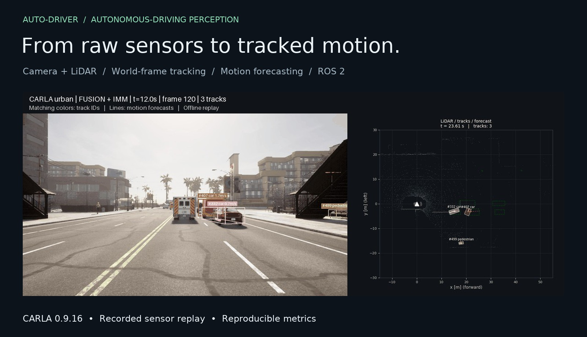
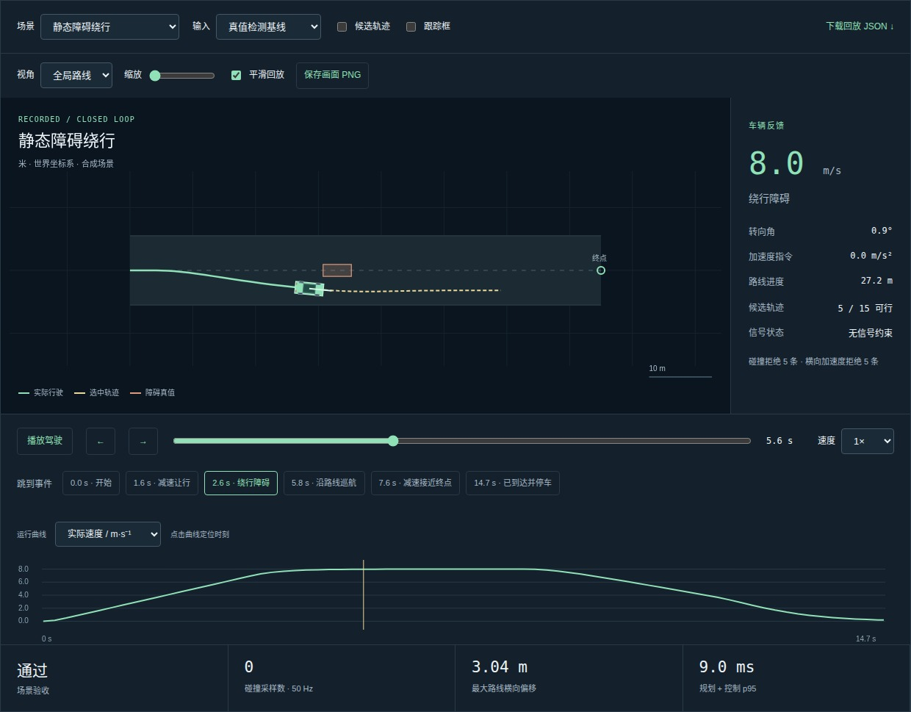
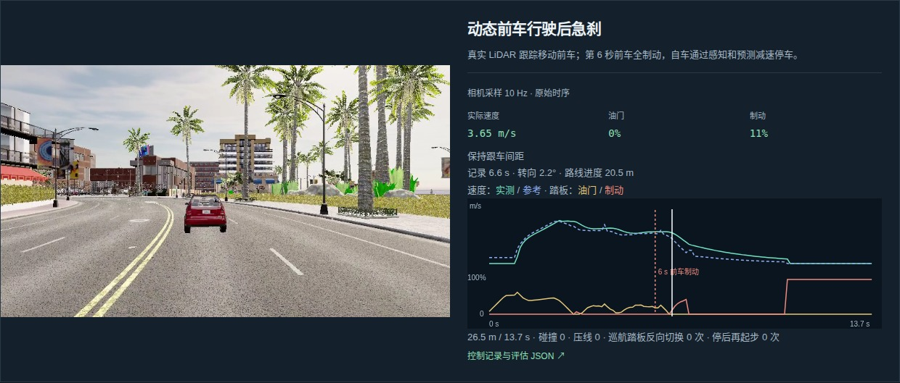
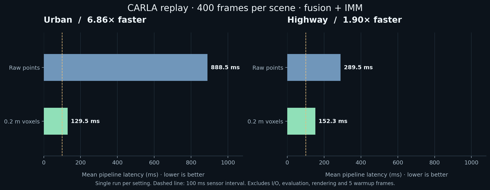
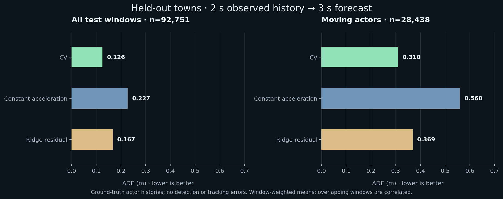

# Auto-Driver

[中文说明](README.md) · [Chinese interactive website](https://ayane225.github.io/Auto-Driver/)

**Camera + LiDAR perception, tracking, forecasting, motion planning and vehicle control, with CARLA validation.**

[](https://github.com/AYANE225/Auto-Driver/actions/workflows/ci.yml)


[](LICENSE)

[**Interactive project page ↗**](https://ayane225.github.io/Auto-Driver/) · [Quickstart](#quickstart) · [Measurements](docs/benchmarks/README.md) · [Engineering guide](docs/engineering.md)

[](https://ayane225.github.io/Auto-Driver/#demo)

A reusable Python + C++ core takes sensor frames through **detection → camera confirmation → world-frame tracking → prediction → planning → control**. Dataset readers and ROS 2 nodes connect perception to CARLA recordings, KITTI raw and synthetic scenes. Planning and control run in closed-loop synthetic tests and a live CARLA client.

| Measured improvement | Evaluation coverage | Engineering delivery |
|---|---|---|
| **6.86×** faster urban pipeline with 0.2 m voxel clustering | **800** CARLA sensor frames, plus six towns of actor trajectories | ROS 2 replay, timestamped TF, Docker, CPU tests and CI |
| 888.5 → 129.5 ms mean; recall 0.2248 → 0.2231 | **92,751** held-out forecast windows; moving actors reported separately | HOTA / IDF1 checked against TrackEval |

[](https://ayane225.github.io/Auto-Driver/#pointcloud)

Explore [3D recorded point clouds](https://ayane225.github.io/Auto-Driver/#pointcloud)
with up to 20,000 display points per sampled frame, [stage timings](https://ayane225.github.io/Auto-Driver/#latency-lab),
[adjustable association examples](https://ayane225.github.io/Auto-Driver/#association-lab),
and [KITTI / VGGT videos](https://ayane225.github.io/Auto-Driver/#gallery).
Point samples are quantized at 2 mm for display only; tracking overlays retain the
previous configuration. The association examples are educational matrices, separate from measured results.

## Closed-loop planning and control

The viewer supports interpolated or recorded-sample playback, an ego-following view, zoom, frame stepping, event navigation, PNG export and clickable speed / acceleration / steering plots. CARLA camera videos retain their newly recorded 10 Hz sampling, with synchronized speed, throttle and brake readings.

[](https://ayane225.github.io/Auto-Driver/#driving)

A* route search, quintic lateral candidates, timed oriented-box collision checks,
time-headway following, curve speed limits, stop lines, Pure Pursuit steering,
speed feedback, emergency braking and stale-input handling are implemented in the core.
**26/26** deterministic acceptance runs passed: thirteen scenarios each with GT detections
and synthetic surface LiDAR processed by the existing detector/tracker/predictor.

New scenarios cover lead-vehicle braking, a lane cut-in, and two pedestrians crossing after a signal turns green. **18/18** parameter-sweep runs passed with varied initial lead positions, lane-change durations and green-light times. Full compressed reports and parameters are linked from the viewer.

The CARLA client drives without ego autopilot. A GT-input lane-following run reached
its goal after **70.82 m**; an actual 64-channel LiDAR run stopped before a parked vehicle
after **32.62 m**. A third actual-LiDAR run handles a moving lead vehicle braking at 6 s. All three recorded zero collision and lane-invasion events, zero cruise pedal reversals and no restarts after stopping. These are
bounded, junction-free single-lane tests; synthetic LiDAR does not model ray occlusion.

[](https://ayane225.github.io/Auto-Driver/#carla-driving)

[Interactive driving replay](https://ayane225.github.io/Auto-Driver/#driving) ·
[CARLA videos](https://ayane225.github.io/Auto-Driver/#carla-driving) ·
[Methods, scope and reproduction](docs/planning_control_zh.md)

```bash
python tools/run_driving.py --scenario all --detector gt --out outputs/driving-gt --assert-success
python tools/run_driving.py --scenario all --detector lidar --out outputs/driving-lidar --assert-success
```

Use new output directories. Neither command requires CARLA.

## Watch the system

<table>
<tr>
<td width="50%"><a href="https://ayane225.github.io/Auto-Driver/#demo"></a><br><b>Urban · Town10HD_Opt</b><br>Mixed traffic and pedestrians · <a href="docs/screenshots/demo_carla_urban.gif">GIF</a></td>
<td width="50%"><a href="https://ayane225.github.io/Auto-Driver/#demo"></a><br><b>Highway · Town04_Opt</b><br>Vehicle traffic · <a href="docs/screenshots/demo_carla_highway.gif">GIF</a></td>
</tr>
</table>

The [project page](https://ayane225.github.io/Auto-Driver/#demo) provides scene switching, native video controls and interactive result tables. Matching colors identify tracks in both views; arrows show estimated velocity and dotted lines show forecasts. The previews retain the original raw-point clustering run, with 120 rendered frames at 5 fps. **Every evaluation processes all 400 sensor frames per scenario. Playback speed is independent of processing throughput.**

## Performance on recorded sensors

Profiling identified DBSCAN on the raw point cloud as the main urban bottleneck. The optional `--voxel-size 0.2` setting clusters point-count-weighted voxel centroids, then uses original points for bounding-box fitting. This reduces clustering cost while retaining the raw point density threshold; voxelization can still change cluster assignments.



| Scene / clustering | Pipeline mean / p95 | Precision | Recall | HOTA | IDF1 |
|---|---:|---:|---:|---:|---:|
| Urban / raw points | 888.5 / 1575.8 ms | 0.5566 | 0.2248 | 0.1833 | 0.1716 |
| Urban / 0.2 m voxels | **129.5 / 171.2 ms** | 0.5565 | 0.2231 | 0.1840 | 0.1726 |
| Highway / raw points | 289.5 / 599.6 ms | 0.2637 | 0.2391 | 0.2010 | 0.0586 |
| Highway / 0.2 m voxels | **152.3 / 497.4 ms** | 0.2526 | 0.2298 | 0.1987 | 0.0585 |

Same 400-frame inputs, YOLOv8n fusion and IMM tracker; one run per setting. Pipeline latency excludes five warmup frames, loading, evaluation and rendering. YOLO runs on RTX 5090; BLAS/OpenMP thread counts are 1. Metrics use class-agnostic BEV IoU, stable actor IDs, a shared LiDAR XY region and front-camera FOV, including occluded GT. HOTA averages 19 thresholds; IDF1 uses IoU 0.5. These are project measurements.

**Limits of this historical comparison:** recall remains low and highway quality decreases slightly with voxelization. These measurements retain the older Python tracker; see the subsequent C++ comparison below. The synthetic latency check in CI does not establish sensor-pipeline real-time performance.

[Full protocol, MOTA and reproduction commands](docs/benchmarks/README.md) · [Urban raw](docs/benchmarks/urban_voxel_0.json) / [voxel](docs/benchmarks/urban_voxel_0.2.json) · [Highway raw](docs/benchmarks/highway_voxel_0.json) / [voxel](docs/benchmarks/highway_voxel_0.2.json)

## Native tracking geometry

Optional C++14 / pybind11 batch BEV IoU reduces mean `tracker.update` time from
44.7 to 3.2 ms in urban recordings and 81.1 to 3.0 ms on the highway (three runs,
fixed detections). With the original association logic, confirmed track IDs,
boxes and velocities match all 800 cached frames exactly.

Fresh full-pipeline runs reduce mean / p95 from **130.2 / 171.8 to 89.3 / 104.0 ms**
(urban) and **152.0 / 498.2 to 78.1 / 101.2 ms** (highway), with the same tracking
metrics. The default now applies the IoU threshold before assignment; optional
π-period box smoothing did not consistently improve metrics and remains opt-in.
There is no measured accuracy gain. Pipeline timing excludes IO and evaluation;
p95 still exceeds the 100 ms sensor interval. See the [full comparison](docs/benchmarks/tracking/README.md).

Normal installation attempts native compilation; `iou_backend="auto"` falls
back to Python when unavailable. Set `PERCEPTION_CORE_NO_NATIVE=1` when installing
from a fresh checkout to disable compilation explicitly. CI tests both modes.

## Forecasting on held-out towns

A separate evaluation uses recorded **ground-truth actor XY histories**: 2 s of observations to predict six future positions through 3 s. Whole towns are split before fitting: train on Town01/02/03, validate on Town04, test on Town05/10HD. Ridge learns residuals from constant velocity; scaling and training use training towns, and alpha is selected by validation ADE.



| Model | All ADE / FDE | Moving ADE / FDE | Moving miss rate (> 2 m) |
|---|---:|---:|---:|
| Constant velocity | **0.126 / 0.258 m** | **0.310 / 0.640 m** | 6.73% |
| Constant acceleration | 0.227 / 0.505 m | 0.560 / 1.254 m | 14.33% |
| Ridge residual | 0.167 / 0.350 m | 0.369 / 0.782 m | **6.30%** |

There are 92,751 test windows, including 28,438 moving windows (at least 0.5 m displacement in the preceding second). Ridge lowers the test miss rate but has higher ADE/FDE than CV. It remains an experimental comparison; the runtime predictor uses CV/CTRV. These window-weighted results use overlapping histories and exclude detection/tracking errors.

[Protocol and data hashes](docs/benchmarks/README.md#forecasting-town-disjoint-actor-histories) · [Full results](docs/benchmarks/forecasting/metrics.json) · [Evaluator](tools/eval_trajectories.py)

## Engineering highlights

| Concern | Implementation | Evidence / entry point |
|---|---|---|
| Reusable algorithms | NumPy / SciPy / scikit-learn core; optional detector backends | [Pipeline](src/perception_core/perception_core/pipeline.py) |
| Moving ego vehicle | Transform detections into world coordinates before tracking; render output copies in the sensor frame | [Coordinate helpers](src/perception_core/perception_core/common/ego_frame.py) |
| ROS 2 integration | Recorded LiDAR + timestamped TF → tracks, predictions and RViz markers | [Integration validation](docs/validation_2026-09-29.md) |
| Evaluation | CLEAR-MOT, HOTA, IDF1, forecast error and per-stage latency | [Evaluation code](src/perception_core/perception_core/eval) |
| Reproducibility | CPU tests, Python 3.9–3.11 CI, Docker and recorded configurations | [CI](.github/workflows/ci.yml) · [Docker](docs/engineering.md#docker-and-ros-2) |

Additional demonstrations are documented in the [engineering guide](docs/engineering.md):

- **KITTI raw drive 0014:** camera confirmation reduces false positives from 5,198 to 469 (91%); recall falls from 0.251 to 0.225 and MOTA remains negative. [Report](docs/screenshots/metrics_kitti_fusion.json)
- **Public VGGT camera front-end:** images → pseudo-LiDAR → shared pipeline. Qualitative only: monocular scale and cross-frame consistency are unresolved. [GIF](docs/screenshots/demo_vggt.gif)
- **Synthetic scenes:** deterministic geometry, motion and latency checks without a simulator or GPU. [GIF](docs/screenshots/demo_prediction.gif)

## Quickstart

Run from the repository root with Python 3.9 or newer. The CPU core needs no CARLA server, ROS or torch.

```bash
git clone https://github.com/AYANE225/Auto-Driver.git
cd Auto-Driver
pip install -e './src/perception_core[test]'

# Run perception and write metrics without rendering.
python tools/run_demo.py --frames 60 --detector lidar --no-video --report metrics.json
python -m pytest -q src/perception_core/tests

# Optional GIF (matplotlib + Pillow).
pip install matplotlib pillow
python tools/run_demo.py --frames 60 --detector lidar --tracker imm \
  --gif outputs/demo.gif --report outputs/demo.json
```

Replay local CARLA recordings with camera fusion and weighted voxel clustering:

```bash
pip install -e './src/perception_core[yolo]'
python carla/replay_demo.py --dataset carla/data/urban --detector fusion \
  --tracker imm --device cuda:0 --fov-eval --voxel-size 0.2 \
  --no-video --report outputs/urban.json

# Forecasting: requires all six recorded town files.
python tools/eval_trajectories.py --root carla/data/trajectories --out outputs/forecasting
```

Raw recordings and pretrained weights are excluded from Git. See [CARLA setup and recording](carla/README.md), [benchmark reproduction](docs/benchmarks/README.md), and [Docker / ROS 2 commands](docs/engineering.md#docker-and-ros-2). In a sourced ROS environment, use `PYTEST_DISABLE_PLUGIN_AUTOLOAD=1` if ROS pytest plugins conflict. Common tasks are available through `make help`.

To preview the project website: `python -m http.server 8000 --directory docs`, then open `http://localhost:8000`. Regenerate figures and video previews with `python tools/make_showcase_assets.py --out outputs/showcase-assets --video` (requires ffmpeg for video).

## Repository map

```text
src/perception_core/      Algorithms, dataset readers, evaluation and tests
src/av_perception_msgs/   ROS 2 tracked / predicted object interfaces
src/av_perception/        ROS 2 source and perception nodes
src/av_bringup/           Launch files, parameters and RViz configuration
carla/                   Scenario and actor-trajectory recording; offline replay
tools/                   Demos, benchmarks, forecasting evaluation, figure generation
docs/                    Project website, reports and engineering documentation
```

Python · NumPy · SciPy · scikit-learn · ROS 2 Humble · CARLA · YOLO · Matplotlib · pytest · Docker · GitHub Actions. Optional VGGT integration uses the public pretrained model.

MIT licensed code — see [LICENSE](LICENSE). External datasets and pretrained models retain their respective licenses.
