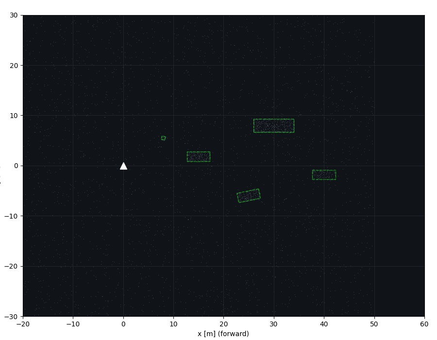
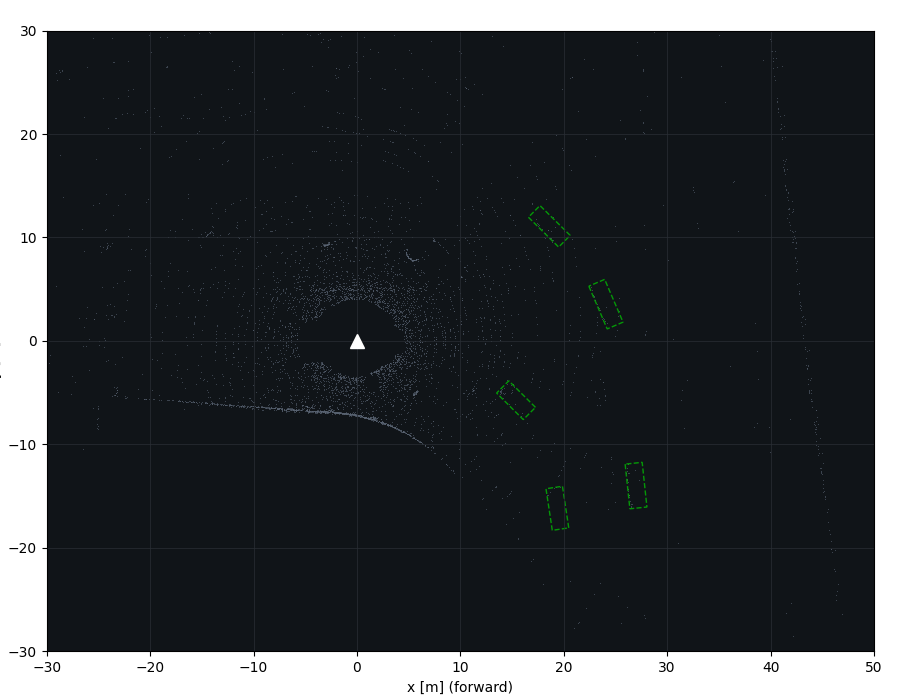

# Auto-Driver — Autonomous-Driving Perception, Tracking & Prediction


An end-to-end **perception → sensor fusion → multi-object tracking → motion
prediction** stack for autonomous driving, packaged as **ROS 2 Humble** nodes and
fed by **CARLA** simulation data. The emphasis is *engineering & systems
integration*: a clean, framework-agnostic core, swappable detector backends,
unit tests, CI, and a one-command visual demo.

<p align="center">
  
</p>

> Bird's-eye view of the offline demo: gray LiDAR sweep, green dashed
> ground-truth boxes, colored confirmed tracks with IDs / velocity arrows /
> history trails, and dotted multi-modal trajectory forecasts.

<p align="center">
  
</p>

> IMM (constant-velocity + constant-turn) tracking on a 100-frame scene: the
> turning car (blue) is followed cleanly through its arc while every track emits
> a dotted multi-modal forecast. Reproduce with `--tracker imm`.

## Design goals

- **Framework-agnostic core.** `perception_core` depends only on
  NumPy / SciPy / scikit-learn — **no** hard ROS, CARLA, or deep-learning
  dependency — so the algorithms are unit-tested on CPU in seconds and reused
  unchanged from a ROS node, a CARLA client, or an offline batch script.
- **Swappable backends (Strategy pattern).** LiDAR clustering, an optional YOLO
  camera detector, and a ground-truth replay all implement one `Detector`
  interface; the pipeline never changes.
- **Fail-safe fusion.** Camera-LiDAR fusion degrades gracefully to LiDAR-only
  when no calibrated camera is present.
- **Honest evaluation.** Built-in CLEAR-MOT metrics (MOTA / MOTP / ID-switches /
  precision / recall) and prediction metrics (ADE / FDE / minADE / minFDE /
  miss-rate) so results are measured, not asserted — plus a latency benchmark
  with an optional real-time budget gate wired into CI.

## Architecture

```
                        ┌──────────────────────── perception_core (pure Python) ────────────────────────┐
 CARLA / rosbag2        │                                                                                │
  LiDAR + cameras  ──►  │  Detection ──► (Camera-LiDAR Fusion) ──► Tracking ──► Prediction ──► Output    │
  (sensor_msgs)         │  RANSAC+DBSCAN     2D IoU label          KF + Hungarian   CV / CTRV             │
                        │  +PCA box / YOLO   transfer              AB3DMOT lifecycle multi-modal          │
                        └───────────────────────────────────┬────────────────────────────────────────────┘
                                                             │
              ROS 2 Humble nodes (rclpy)  ◄──────────────────┘   RViz2 / Foxglove MarkerArray viz
```

Detections are lifted into the world frame via the ego pose before tracking, so
track states and forecasts live in a stable global frame even while the ego
vehicle moves.

## Results (offline demo, LiDAR detector)

60-frame synthetic sequence, 5 actors (cars, a turning car, a truck, a
pedestrian), classical LiDAR detector — matched to ground truth by BEV IoU:

| Metric      | Value | | Metric        | Value |
|-------------|-------|-|---------------|-------|
| Precision   | 0.95  | | MOTA          | 0.777 |
| Recall      | 0.823 | | MOTP (IoU)    | 0.772 |
| ID switches | 1     | | Frames        | 60    |

Reproduce: `python tools/run_demo.py --frames 60 --detector lidar --report metrics.json`
(add `--tracker imm` for the IMM bank — see [`demo_imm.gif`](docs/screenshots/demo_imm.gif)).

### Prediction accuracy (ADE / FDE)

Physics forecasters scored on a self-contained analytic manoeuvre bank (3 s
horizon, 0.5 s step). The bank deliberately mixes manoeuvres the
constant-velocity / constant-turn-rate models fit exactly with ones they
provably cannot, so the report shows *honest* error instead of a rigged score:

| Scenario      | ADE (m)  | FDE (m)  | Miss | Note                          |
|---------------|----------|----------|------|-------------------------------|
| straight      | 0.00     | 0.00     | 0.00 | CV exact                      |
| steady_turn   | 0.00     | 0.00     | 0.00 | CTRV exact                    |
| accelerate    | 4.74     | 11.25    | 1.00 | unmodelled a = 2.5 m/s²       |
| lane_change   | 2.04     | 3.50     | 1.00 | unmodelled 3.5 m lateral shift |
| **Overall**   | **1.70** | **3.69** | **0.50** | 4 scenarios               |

Reproduce: `python tools/eval_prediction.py --report prediction.json`

### Real-time latency

Per-stage latency of the full detect → fuse → track → predict loop over a
120-frame synthetic sequence (5 actors, ground-truth detector; single CPU core,
machine-dependent). Both motion models clear the 10 Hz sensor rate by two orders
of magnitude:

| Tracker      | detect | track | predict | end-to-end (mean / p95) | throughput |
|--------------|--------|-------|---------|-------------------------|------------|
| CV           | 0.01   | 0.74  | 0.05    | 0.80 / 0.85 ms          | ~1250 Hz   |
| IMM (CV+CT)  | 0.01   | 0.97  | 0.05    | 1.03 / 1.06 ms          | ~970 Hz    |

The IMM bank runs two filters plus the interaction/mixing step, so it costs
~30 % more tracking time in exchange for turn-rate estimation and constant-turn
forecasting. CI runs the benchmark with a loose `--budget-ms 150` gate, so a
performance regression fails the build.

Reproduce: `python tools/benchmark.py --detector gt --tracker imm --frames 120 --budget-ms 150`

## Real-data validation (KITTI raw)

The same pipeline runs **unchanged** on the real KITTI raw dataset (64-beam
Velodyne + camera + OXTS ego-motion). A `KittiRawReader` turns a drive into the
identical `Frame` objects, so nothing in detection / fusion / tracking /
prediction changes — only the data source. Numbers below are on drive
`2011_09_26_0014` (314 frames, 1142 tracklet poses, dense city traffic).

**1. Tracking & prediction quality (GT-replay).** Replaying the tracklet labels
as noisy detections isolates the tracking + prediction stages on *real* ego
motion — the world-frame MOT stays locked through the car's actual turns:

| Metric      | Value | | Metric           | Value    |
|-------------|-------|-|------------------|----------|
| MOTA        | 0.641 | | Precision        | 0.795    |
| MOTP (IoU)  | 0.822 | | Recall           | 0.864    |
| ID switches | **1** | | Frames / objects | 314/1142 |

<p align="center">
  
</p>

**2. Detection on real clutter — why fusion matters.** The classical geometric
detector, tuned on clean synthetic scenes, is *flooded* by urban clutter
(buildings, vegetation and poles all form car-sized clusters). Wiring in a stock
**YOLO camera detector** as a camera-LiDAR **fusion gate** — drop any LiDAR
cluster inside the image that no camera detection confirms — is a *learned*
detector rescuing precision on real data. Scored inside the camera frustum
(KITTI's standard annotation region):

| Detector (camera FOV)          | Precision | Recall | False positives | MOTA   |
|--------------------------------|-----------|--------|-----------------|--------|
| Classical LiDAR only           | 0.051     | 0.251  | 5198            | −4.40  |
| **+ YOLO camera-LiDAR gate**   | **0.533** | 0.181  | **177**         | **+0.02** |

The camera gate cuts false positives by **97 %** and lifts precision **10×**,
flipping MOTA positive. Recall drops — the gate can only *reject*, never add, and
is capped by the geometric clusterer's own recall. That ceiling is precisely why
production stacks reach for a learned 3D detector; the pluggable `Detector`
interface exists so one drops straight in.

Reproduce:

```bash
# tracking/prediction on real data (GT-replay) + BEV GIF
python tools/run_kitti_demo.py --root data/kitti --drive 14 --detector gt \
    --gif docs/screenshots/demo_kitti.gif --report metrics_kitti.json
# classical detector vs. YOLO camera-LiDAR fusion gate (needs the [yolo] extra + a torch env)
python tools/run_kitti_demo.py --root data/kitti --drive 14 --detector lidar --fov-eval
python tools/run_kitti_demo.py --root data/kitti --drive 14 --detector fusion
```

## Camera-only front-end (optional VGGT)

A pluggable **camera → pseudo-LiDAR** front-end lets the *same* pipeline run with
no LiDAR at all. `VggtLidarDetector` feeds images to the **public**
[VGGT](https://github.com/facebookresearch/vggt) model (Visual Geometry Grounded
Transformer, CVPR 2025), turns its dense 3D point map into an `(N, 4)`
pseudo-LiDAR sweep, and hands that to the existing RANSAC-ground + DBSCAN
clusterer — so detection, tracking and prediction downstream are unchanged. Swap
the sensor, keep the stack.

- **Optional & isolated.** `torch` and the `vggt` package are lazy-imported and
  live behind the `vggt` extra, so `perception_core` and its CI stay torch-free.
  The torch-free post-processing (point-map → ego-frame cloud, with confidence
  filtering and the camera→ego axis transform) is unit-tested; the
  detector↔clusterer composition is tested with a mocked backend.
- **Honest limits.** Monocular geometry is recovered up to scale (pass `--scale`
  or use multi-view input); this integrates a *public pretrained* model, it is
  not a bespoke learned 3D detector.

```bash
pip install 'src/perception_core[vggt,viz]'   # torch + public VGGT + matplotlib
python tools/run_vggt_demo.py --images path/to/frames --tracker imm \
    --gif outputs/vggt_demo.gif --scale 1.0
```

## Component summary

| Stage      | Default implementation                                    | Key deps            |
|------------|-----------------------------------------------------------|---------------------|
| Detection  | `LidarClusterDetector` — RANSAC ground + DBSCAN + PCA box | scikit-learn        |
| Detection  | `YoloCameraDetector` — optional 2D camera detector        | ultralytics *(opt)* |
| Detection  | `VggtLidarDetector` — public VGGT camera→pseudo-LiDAR      | torch, vggt *(opt)* |
| Detection  | `GroundTruthDetector` — replay for tests / CI / demo      | –                   |
| Fusion     | `LateFusion` — project 3D→image, 2D-IoU label transfer    | –                   |
| Tracking   | `MultiObjectTracker` — CV Kalman **or** IMM (CV+CT) + Hungarian, optional Mahalanobis gating | scipy |
| Prediction | `MotionPredictor` — CV / CTRV, multi-modal                | –                   |
| Evaluation | CLEAR-MOT · ADE/FDE prediction metrics · latency benchmark | numpy              |

## Repository layout

```
carla_av_perception/
├── src/perception_core/     # framework-agnostic core library (+ unit tests)
│   └── perception_core/     #   common · detection · fusion · tracking · prediction · io · eval · viz
├── src/av_perception_msgs/  # ROS 2 custom interfaces (tracked / predicted objects)
├── src/av_perception/       # ROS 2 rclpy nodes wrapping perception_core
├── src/av_bringup/          # ROS 2 launch files, params, RViz config
├── tools/run_demo.py        # offline end-to-end demo + BEV GIF + metrics (--tracker cv|imm)
├── tools/run_kitti_demo.py  # same pipeline on real KITTI raw + honest CLEAR-MOT
├── tools/benchmark.py       # per-stage latency / throughput + optional real-time budget gate
├── tools/eval_prediction.py # ADE/FDE prediction accuracy on an analytic manoeuvre bank
├── tools/run_vggt_demo.py   # optional camera-only demo: public VGGT pseudo-LiDAR → pipeline
├── docs/                    # screenshots, architecture notes
└── .github/workflows/ci.yml # test (py3.9–3.11) · lint · smoke · bench matrix
```

## Status

| Layer | Description | Status |
|-------|-------------|--------|
| `perception_core` | Detection (LiDAR · YOLO fusion · VGGT camera front-end) / tracking (CV + IMM) / prediction + ADE/FDE & latency benchmarks + 66 unit tests | ✅ done |
| Offline demo + CI | BEV renderer, GIF, CLEAR-MOT report, latency budget gate, GitHub Actions | ✅ done |
| ROS 2 layer | Custom msgs, rclpy nodes, launch + RViz visualization | ✅ done |
| CARLA layer | Sensor bridge, NPC traffic, record → replay dataset | ✅ done |
| Real-data (KITTI) | `KittiRawReader`, GT-replay tracking, YOLO camera-LiDAR fusion gate | ✅ done |

## Quickstart

```bash
# 1. Install the core library
pip install -e "src/perception_core[viz]"

# 2. Run the offline end-to-end demo (writes a BEV GIF + a metrics report)
python tools/run_demo.py --frames 60 --detector lidar \
    --gif docs/screenshots/demo_lidar.gif --report metrics.json

# 3. Run the unit tests
pip install -e "src/perception_core[test]"
pytest -q src/perception_core
```

> Inside a **sourced ROS 2 environment**, disable the incompatible ROS pytest
> plugins first: `PYTEST_DISABLE_PLUGIN_AUTOLOAD=1 pytest -q`.

### Run the ROS 2 graph

```bash
# Build the workspace (ROS 2 Humble sourced)
colcon build --packages-select av_perception_msgs av_perception av_bringup
source install/setup.bash

# Launch: synthetic LiDAR publisher + perception node + RViz (no CARLA needed)
ros2 launch av_bringup perception.launch.py            # add rviz:=false for headless
```

The graph publishes `~/tracks` (`TrackedObjectArray`), `~/predictions`
(`PredictedObjectArray`) and `~/markers` (`MarkerArray` for RViz). Point the
`perception_node` at a real source by remapping `/lidar/points`.

### Feed it CARLA data

```bash
# See carla/README.md — record a scenario from a CARLA server, then either
# replay it offline through the same pipeline ...
python carla/replay_demo.py --dataset carla/data/urban --gif docs/screenshots/demo_carla.gif
# ... or republish it into the ROS 2 graph as /lidar/points.
```


## Tech stack

Python · NumPy · SciPy · scikit-learn · ROS 2 Humble (rclpy) · RViz2 ·
rosbag2 · CARLA · Matplotlib · pytest · GitHub Actions. Optional: ultralytics
(YOLO), VGGT (torch, camera→pseudo-LiDAR), Open3D.

## License

MIT — see [LICENSE](LICENSE).

