# Auto-Driver

**自动驾驶感知、预测、规划与控制：从相机和激光雷达输入，到可复现的闭环驾驶验证。**

[](https://github.com/AYANE225/Auto-Driver/actions/workflows/ci.yml)


[](LICENSE)

[**打开中文交互展示页 ↗**](https://ayane225.github.io/Auto-Driver/) · [快速开始](#快速开始) · [中文工程说明](docs/engineering_zh.md) · [评估协议](docs/benchmarks/README.md) · [English](README.en.md)

[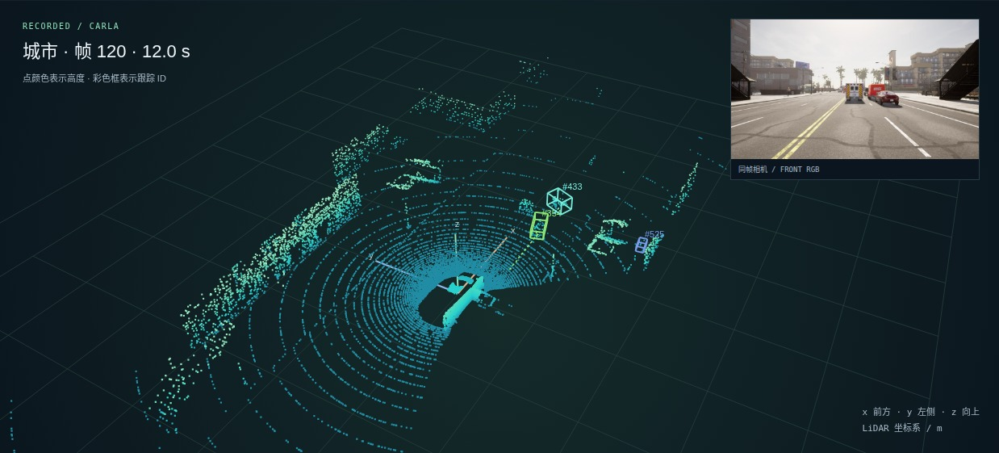](https://ayane225.github.io/Auto-Driver/#pointcloud)

<p align="center"><b>转动 3D 场景 · 拆开每帧耗时 · 调整匹配阈值 · 查看实车实验</b><br />
<a href="https://ayane225.github.io/Auto-Driver/#pointcloud">进入 3D 点云</a> ·
<a href="https://ayane225.github.io/Auto-Driver/#latency-lab">耗时拆解</a> ·
<a href="https://ayane225.github.io/Auto-Driver/#association-lab">匹配演示</a> ·
<a href="https://ayane225.github.io/Auto-Driver/#gallery">实验视频</a></p>


项目使用独立 Python + C++ 核心完成 **检测 → 相机确认 → 世界坐标系跟踪 → 运动预测 → 路径规划 → 车辆控制**。CARLA、KITTI 和合成场景提供统一输入；ROS 2 节点复用感知算法，规划与控制已有合成闭环及 CARLA 实际车辆验证。

| 实测改进 | 评估规模 | 工程交付 |
|---|---|---|
| C++ 后城市流水线 **130.2 → 89.3 ms**，高速 **152.0 → 78.1 ms** | 两场景共 **800 帧**传感器记录 | ROS 2 回放、时间戳 TF、Docker、CPU 测试、CI |
| 0.2 m 体素聚类；城市召回率 0.2248 → 0.2231 | 六城镇轨迹；**92,751** 个测试窗口 | HOTA / IDF1 与 TrackEval 对照 |
| **26/26** 合成闭环验收通过 | 真值检测与合成 LiDAR，各 13 个场景 | CARLA 车道行驶、实际 LiDAR 障碍停车；自车关闭 autopilot |

## 规划与控制已经接入

[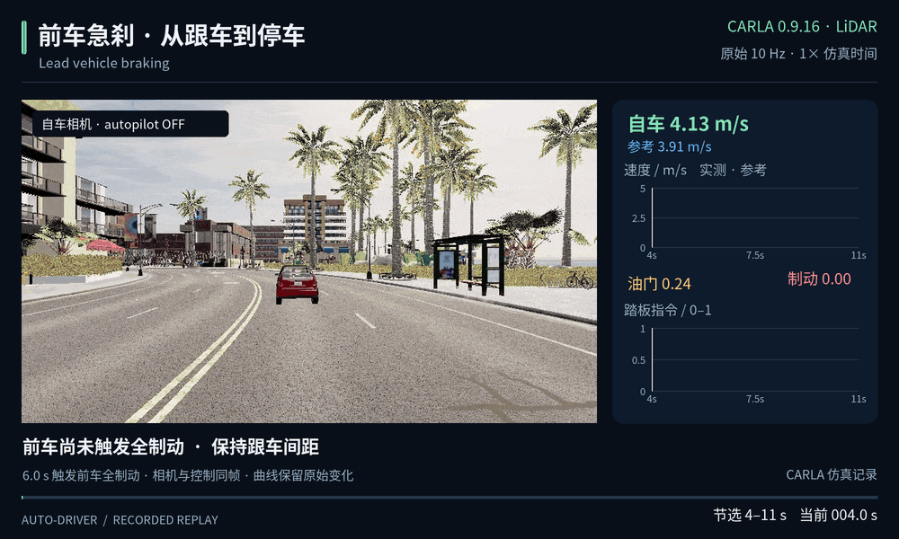](https://ayane225.github.io/Auto-Driver/#driving-gifs)

**CARLA 前车急刹 · 4–11 s · LiDAR 输入 · 原始 10 Hz · 1× 仿真时间。** 前车在第 6 秒全制动，曲线保留实际油门与制动变化。[完整视频与曲线 ↗](https://ayane225.github.io/Auto-Driver/#carla-driving)

- **路线与避障：** 有向道路图 A*、封闭边重选路线、五次多项式局部轨迹、动态矩形碰撞检查。
- **驾驶行为：** 弯道限速、时间间距跟车、横穿行人让行、停车线约束、绿灯起步、终点停车。
- **车辆控制：** Pure Pursuit 转向、速度反馈、转向与加减速限制、紧急制动、感知超时后的制动与恢复。
- **实际闭环：** CARLA 中控制 Tesla Model 3 完成约 **70.82 m** 的车道路线；真实 64 线 LiDAR 测试行驶 **32.62 m** 后在障碍前停车。另有真实 LiDAR 前车急刹测试；三次均未记录碰撞或压线，巡航踏板反向切换为 0。

十三个合成场景分别使用真值检测和带噪声表面点云检测，26 次运行全部通过，保留完整指标与运行数据。
新增前车急刹、邻道切入、绿灯后连续行人横穿；改变车距、切入时长与绿灯时刻的 **18/18** 次参数测试通过，可下载逐项记录。

<table>
<tr>
<td width="50%"><a href="https://ayane225.github.io/Auto-Driver/#driving-gifs">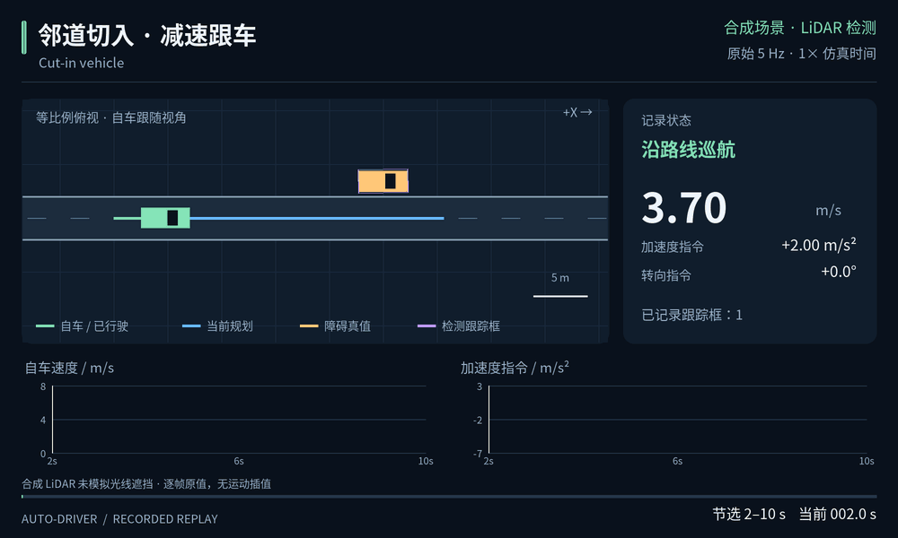</a><br /><b>邻道切入 → 减速跟车</b><br />合成 LiDAR · 2–10 s · 5 Hz · 1×</td>
<td width="50%"><a href="https://ayane225.github.io/Auto-Driver/#driving-gifs">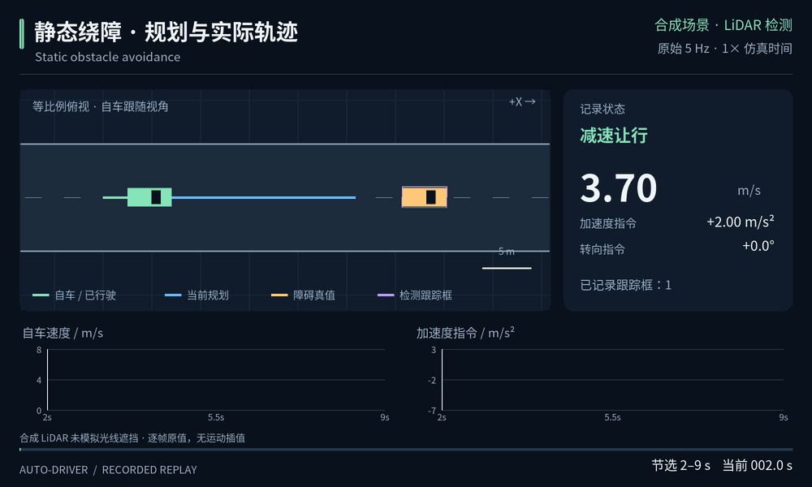</a><br /><b>静态绕障 → 轨迹跟踪</b><br />合成 LiDAR · 2–9 s · 5 Hz · 1×</td>
</tr>
<tr>
<td width="50%"><a href="https://ayane225.github.io/Auto-Driver/#driving-gifs">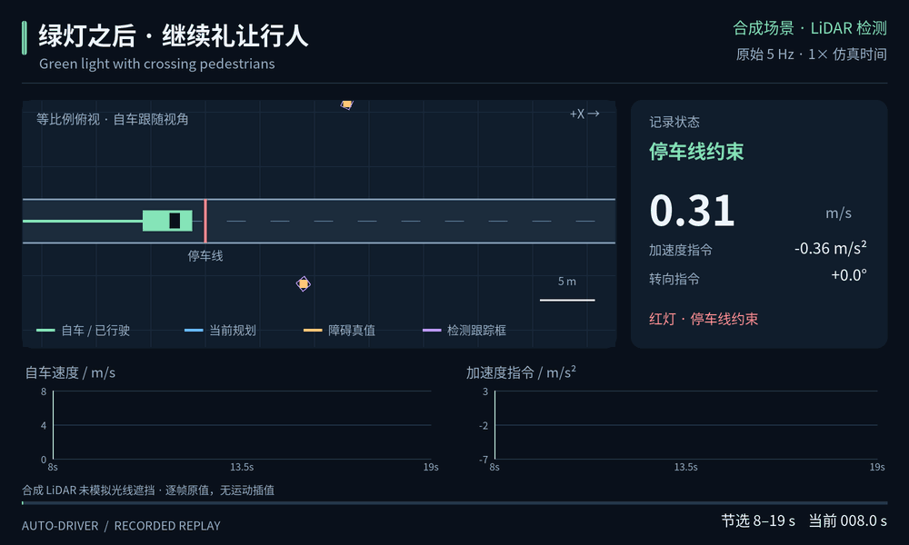</a><br /><b>绿灯亮起 → 继续礼让行人</b><br />合成 LiDAR · 8–19 s · 5 Hz · 1×</td>
<td width="50%"><a href="https://ayane225.github.io/Auto-Driver/#driving-gifs">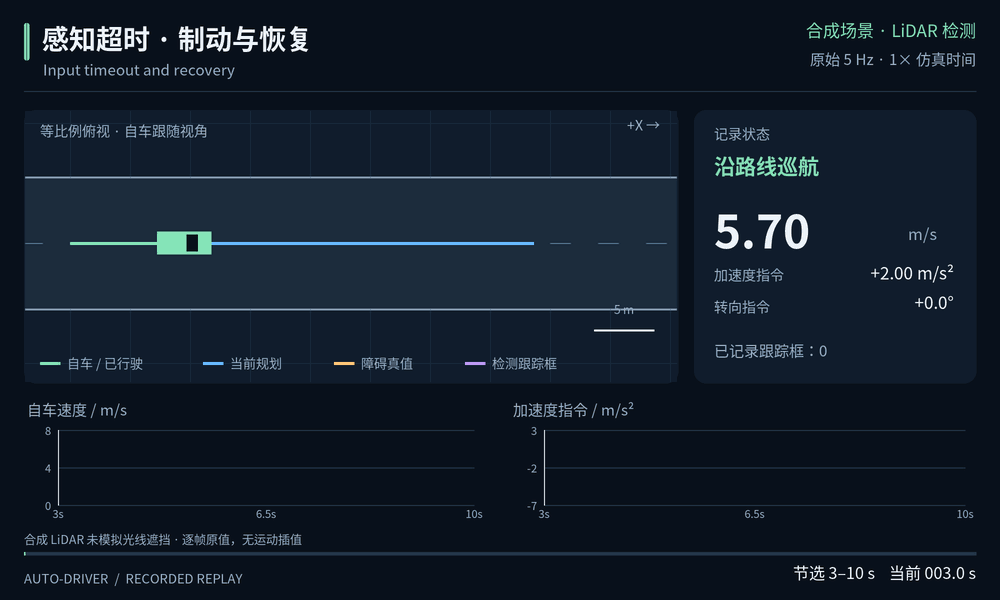</a><br /><b>感知超时 → 停车与恢复</b><br />合成 LiDAR · 3–10 s · 5 Hz · 1×</td>
</tr>
</table>

五段 GIF 均来自已发布的运行记录，未插值运动或平滑控制。曲线只画到当前时刻；末尾有 1.2 秒循环提示。它们是选取的片段，不能代替完整测试或作为实时性证明。[可停止的 GIF 展区 ↗](https://ayane225.github.io/Auto-Driver/#driving-gifs) · [逐帧来源与哈希](docs/assets/driving/gifs/index.json) · [导出与评估范围](docs/driving_gifs.md)

合成点云未模拟光线遮挡；CARLA 测试限定在无路口单车道，红绿灯与绕障目前在合成闭环中验证。

[**播放闭环驾驶 ↗**](https://ayane225.github.io/Auto-Driver/#driving) · [CARLA 实际控制视频](https://ayane225.github.io/Auto-Driver/#carla-driving) · [方法与复现](docs/planning_control_zh.md) · [全部运行指标](docs/assets/driving/index.json) · [控制修复验证](docs/control_validation_2026-09-29.md)

```bash
python tools/run_driving.py --scenario all --detector gt \
  --out outputs/driving-gt --assert-success
python tools/run_driving.py --scenario all --detector lidar \
  --out outputs/driving-lidar --assert-success
```

安装方式见下方快速开始；这两条命令不需要 CARLA。输出目录须为新目录。

## 在线可以操作什么

[展示页](https://ayane225.github.io/Auto-Driver/) 提供以下功能，无需安装仿真器：

- **闭环驾驶：** 十三场景、两种输入；平滑回放或原始采样、全局或跟随视角、缩放、逐帧检查与 PNG / JSON 下载。候选轨迹按需开启。
- **事件与曲线：** 一键跳到绕障、制动、绿灯、感知超时等记录；切换速度、加速度和转向曲线，点击曲线定位时刻。
- **CARLA 控制视频：** 三段自车相机视频与实测／参考速度、油门、制动曲线同步，支持点击曲线定位；新录制 10 Hz 原始相机采样和完整评估报告。
- **3D 点云：** 城市、高速共 42 个时刻，切换斜视/俯视/前视，拖动旋转、环绕观察、缩放与 PNG 下载。每帧最多 20,000 个显示点，支持轻量模式和键盘操作；相机画面与点云同步更新。
- **耗时拆解：** 从实测 JSON 绘制四阶段堆叠条形图；切换场景、选择阶段，看清时间主要花在哪里。
- **匹配演示：** 调整 IoU 阈值，比较分配前后过滤的结果；另一个示例说明最大总 IoU 与最大匹配数量的差别。
- **实验视频展区：** 直接播放 KITTI 实车记录和公开 VGGT 前端的已有演示，注明各自评估范围。
- **双场景视频回放：** 原始相机画面与鸟瞰跟踪图同步显示，支持播放、暂停与跳转。
- **逐帧查看器：** 连续处理每个场景全部 400 帧后，导出 42 个采样时刻。拖动时间轴，切换点云、真值、跟踪、历史及预测图层；选择目标 ID 查看速度、尺寸和未更新帧数。
- **点云交互：** 缩放、拖动画布，保存当前 PNG，下载当前帧 JSON。每帧最多显示 2,500 个抽样点，检测与评估仍使用原始输入。
- **性能对照：** 切换城市/高速场景，比较原始点聚类与体素聚类，并导出 CSV。
- **预测对照：** 按测试城镇和移动对象筛选总体指标；查看 24 个固定规则抽取的预测示例，与实际未来轨迹逐点对照，切换模型曲线并保存图像。
- **运行命令生成：** 选择数据源、检测器、跟踪模型、设备和体素设置，生成可复制命令；不支持的组合会禁用。

<table>
<tr><td width="50%"><a href="https://ayane225.github.io/Auto-Driver/#latency-lab">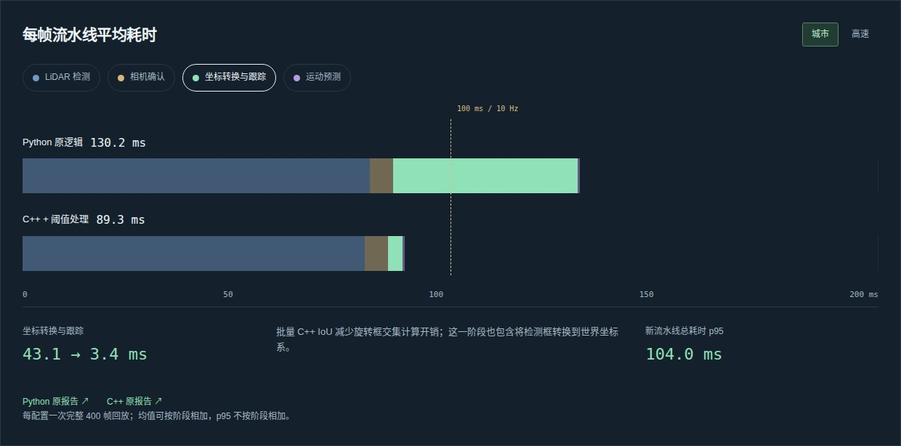</a><br /><b>耗时拆解</b> · 相同尺度查看 C++ 改动前后</td>
<td width="50%"><a href="https://ayane225.github.io/Auto-Driver/#association-lab">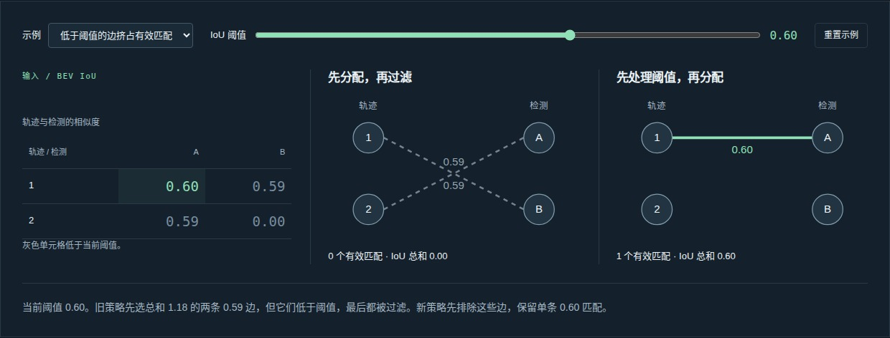</a><br /><b>关联算法演示</b> · 可调参数与明确的优化目标</td></tr>
</table>

<details><summary>展开城市与高速的相机 / BEV 视频预览</summary>

<table>
<tr>
<td width="50%"><a href="https://ayane225.github.io/Auto-Driver/#explorer">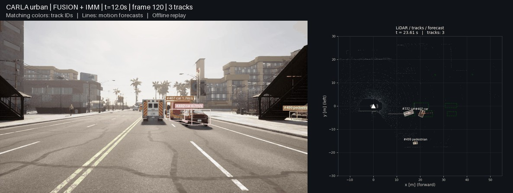</a><br><b>城市 · Town10HD_Opt</b><br>混合交通与行人 · <a href="docs/screenshots/demo_carla_urban.gif">查看 GIF</a></td>
<td width="50%"><a href="https://ayane225.github.io/Auto-Driver/#explorer">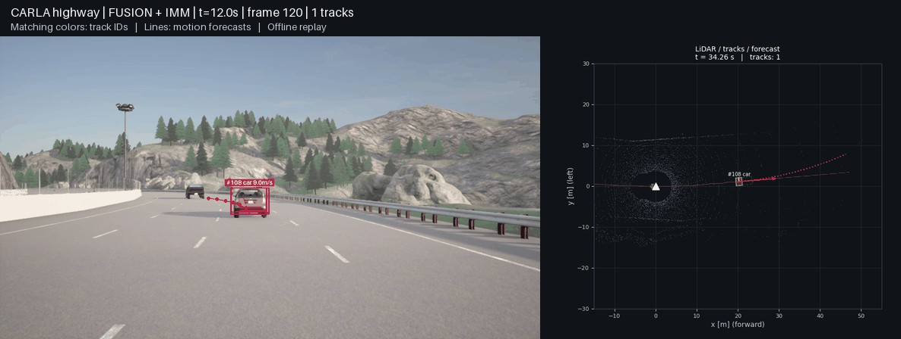</a><br><b>高速 · Town04_Opt</b><br>车辆交通 · <a href="docs/screenshots/demo_carla_highway.gif">查看 GIF</a></td>
</tr>
</table>

</details>

浏览器读取实际运行导出的数据，不在线执行感知模型。CARLA 是模拟器记录；KITTI 是独立的真实道路数据实验。3D 显示点独立从对应原始帧抽样，量化步长 2 mm；教学匹配矩阵不计入实验指标。24 秒视频沿用原始点聚类运行，逐帧查看器使用 0.2 m 体素配置，二者不是同一次计时实验，且均保留 C++ 改动前的跟踪配置。

## C++ 跟踪加速与算法验证

将旋转框 BEV IoU 改为 C++14 批量计算，缓存顶点并提前排除不相交框。
固定检测输入的三轮对照中，城市跟踪均值 **44.7 → 3.2 ms（13.9×）**，
高速 **81.1 → 3.0 ms（26.6×）**；只替换计算后端时，800 帧确认轨迹的 ID、框与速度完全一致。

| 场景 | 本轮 Python 原逻辑：流水线平均 / p95 | C++ + 阈值处理：流水线平均 / p95 |
|---|---:|---:|
| 城市 | 130.2 / 171.8 ms | **89.3 / 104.0 ms** |
| 高速 | 152.0 / 498.2 ms | **78.1 / 101.2 ms** |

完整流水线另行各跑一次，使用相同的 0.2 m 体素、YOLOv8n、IMM 和 400 帧输入。
默认在分配前处理 IoU 阈值，修复无效边挤占有效匹配的边界问题；本次 HOTA、IDF1、MOTA
与旧逻辑相同，不能宣称精度提高。π 周期框朝向平滑未稳定改善指标，保留为可选项。
均值低于 10 Hz 的 100 ms 间隔，但 p95 仍略超出，且计时不含读盘、渲染与评估。

[五项消融、安装与复现](docs/benchmarks/tracking/README.md) · [在线 C++ 对照](https://ayane225.github.io/Auto-Driver/#native-tracking)

## 传感器回放：体素聚类历史对照

剖析发现城市点云的主要耗时在 DBSCAN。新增 `--voxel-size 0.2`：以体素内点数为权重，在体素质心上聚类，再用原始点拟合包围框。它保留点数密度阈值，但近似邻域几何，可能改变聚类结果。

| 场景 / 聚类 | 流水线平均 / p95 | Precision | Recall | HOTA | IDF1 |
|---|---:|---:|---:|---:|---:|
| 城市 / 原始点 | 888.5 / 1575.8 ms | 0.5566 | 0.2248 | 0.1833 | 0.1716 |
| 城市 / 0.2 m 体素 | **129.5 / 171.2 ms** | 0.5565 | 0.2231 | 0.1840 | 0.1726 |
| 高速 / 原始点 | 289.5 / 599.6 ms | 0.2637 | 0.2391 | 0.2010 | 0.0586 |
| 高速 / 0.2 m 体素 | **152.3 / 497.4 ms** | 0.2526 | 0.2298 | 0.1987 | 0.0585 |

每个设置运行一次，使用相同 400 帧输入、YOLOv8n 相机确认与 IMM 跟踪器。YOLO 使用 RTX 5090，BLAS/OpenMP 线程数设为 1。计时不含前 5 帧预热、读盘、渲染和评估。所有指标按统一 LiDAR XY 区域与前视相机 FOV 计算，使用稳定 actor ID，包含被遮挡真值。

**当前限制：** 召回率仍低，体素化后高速场景的指标略降；此处保留旧版 Python 跟踪器的计时；本轮 C++ 结果见上表。视频播放速度和合成 GT 检测器的 CI 耗时不能作为完整传感器流水线实时性的证据。

[详细协议与复现命令](docs/benchmarks/README.md) · [城市原始点](docs/benchmarks/urban_voxel_0.json) / [体素](docs/benchmarks/urban_voxel_0.2.json) · [高速原始点](docs/benchmarks/highway_voxel_0.json) / [体素](docs/benchmarks/highway_voxel_0.2.json)

## 六城镇轨迹预测

使用真值 XY 历史：2 秒观测，预测未来 3 秒的 6 个位置。整座城镇先划分再训练：Town01/02/03 训练，Town04 验证，Town05/10HD 测试。Ridge 学习相对于恒速度预测的残差；标准化与拟合仅使用训练集，正则化系数仅按验证集 ADE 选择。

| 模型 | 全部对象 ADE / FDE | 移动对象 ADE / FDE | 移动对象未命中率（FDE > 2 m） |
|---|---:|---:|---:|
| 恒速度 CV | **0.126 / 0.258 m** | **0.310 / 0.640 m** | 6.73% |
| 恒加速度 CA | 0.227 / 0.505 m | 0.560 / 1.254 m | 14.33% |
| Ridge 残差回归 | 0.167 / 0.350 m | 0.369 / 0.782 m | **6.30%** |

共 92,751 个测试窗口，其中 28,438 个在过去 1 秒位移至少 0.5 m，归为移动对象。Ridge 降低了测试未命中率，但 ADE/FDE 高于 CV，保留为离线对照；运行流水线继续使用 CV/CTRV。重叠窗口存在相关性，结果按窗口数加权，不包含感知与跟踪误差。

[完整结果与原始文件哈希](docs/benchmarks/forecasting/metrics.json) · [评估脚本](tools/eval_trajectories.py) · [在线预测示例](https://ayane225.github.io/Auto-Driver/#forecast-examples)

## 工程实现

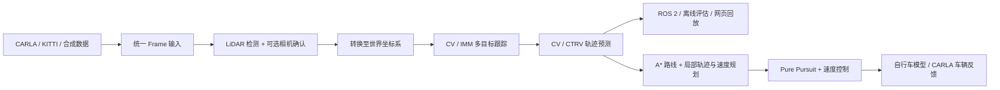
```mermaid
flowchart LR
    A[CARLA / KITTI / 合成数据] --> B[统一 Frame 输入]
    B --> C[LiDAR 检测 + 可选相机确认]
    C --> D[转换至世界坐标系]
    D --> E[CV / IMM 多目标跟踪]
    E --> F[CV / CTRV 轨迹预测]
    F --> G[ROS 2 / 离线评估 / 网页回放]
    F --> H[A* 路线 + 局部轨迹与速度规划]
    H --> I[Pure Pursuit + 速度控制]
    I --> J[自行车模型 / CARLA 车辆反馈]
```

- **独立算法核心：** NumPy、SciPy、scikit-learn，可选 C++14 / pybind11 批量 IoU；深度模型、可视化、ROS 和 CARLA 为可选依赖。
- **移动自车坐标处理：** 检测框在传感器时间戳对应位姿下转到世界系；绘图时对输出副本变换回传感器系。
- **ROS 2：** 点云与时间戳 TF 接入核心，发布跟踪、预测和 RViz 标记；[已有接入验证](docs/validation_2026-09-29.md)。
- **可替换后端：** 几何 LiDAR 检测、YOLO 框确认、真值回放，以及公开 VGGT 的纯相机前端。
- **KITTI：** 单序列中，相机确认将误报从 5,198 降至 469，但召回率下降且 MOTA 仍为负；[完整报告](docs/screenshots/metrics_kitti_fusion.json)。
- **VGGT：** 图像转伪点云的定性集成展示，单目米制尺度和跨帧一致性尚未解决；[演示 GIF](docs/screenshots/demo_vggt.gif)。

## 快速开始

Python 3.9 或更新版本；CPU 核心不需要 CARLA、ROS 或 torch。在仓库根目录运行：

```bash
git clone https://github.com/AYANE225/Auto-Driver.git
cd Auto-Driver
pip install -e './src/perception_core[test]'
python tools/run_demo.py --frames 60 --detector lidar --tracker imm \
  --no-video --report outputs/demo.json
python -m pytest -q src/perception_core/tests
```

正常安装会尝试编译 C++14 扩展；不可用时 `auto` 退回 Python。可用 `python -c 'from perception_core.common.iou import resolve_iou_backend; print(resolve_iou_backend())'` 检查实际后端。纯 Python 安装与原生安装均纳入 CI。

生成合成场景 GIF：

```bash
pip install matplotlib pillow
python tools/run_demo.py --frames 60 --detector lidar --tracker imm \
  --gif outputs/demo.gif --report outputs/demo.json
```

用自己的 CARLA 记录运行相机融合，并导出网页查看数据：

```bash
pip install -e './src/perception_core[yolo]'
pip install pillow
python carla/replay_demo.py --dataset carla/data/urban --detector fusion \
  --tracker imm --device cuda:0 --fov-eval --voxel-size 0.2 \
  --no-video --report outputs/urban.json \
  --export-replay outputs/urban_viewer --export-every 20
```

原始记录与模型权重不在 Git 中，需先准备；导出目录应为新的目录。更多步骤见[中文工程说明](docs/engineering_zh.md)、[CARLA 采集说明](carla/README.md)及网页的[命令生成器](https://ayane225.github.io/Auto-Driver/#run)。ROS 环境中若 pytest 插件冲突，可设置 `PYTEST_DISABLE_PLUGIN_AUTOLOAD=1`。

```bash
# 六城镇预测评估，需要全部录制文件。
python tools/eval_trajectories.py --root carla/data/trajectories --out outputs/forecasting
# 本地预览网页。
python -m http.server 8000 --directory docs
```

打开 `http://localhost:8000`。网页无需构建工具；功能与数据在仓库内，浏览器按需加载回放帧。常用开发命令见 `make help`。网页浏览器回归检查已接入 CI；[本轮验证记录](docs/website_validation_2026-09-29.md)列出数据核对、交互测试与显示范围。

## 目录

```text
src/perception_core/      算法、数据读取、评估、网页导出与测试
src/av_perception_msgs/   ROS 2 跟踪与预测接口
src/av_perception/        ROS 2 数据源和感知节点
src/av_bringup/           启动文件、参数与 RViz 配置
carla/                   场景与轨迹采集、离线回放
tools/                   演示、评估、预测示例导出、图表生成
docs/                    中文展示页、实测报告、工程说明
```

代码采用 [MIT 许可](LICENSE)。外部数据与预训练模型适用各自许可。
