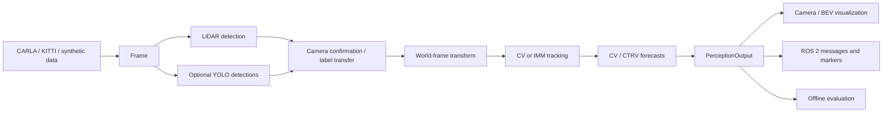

# Engineering guide

[Project overview](../README.md) · [Measured comparisons](benchmarks/README.md) ·
[CARLA recording](../carla/README.md) · [Integration validation](validation_2026-09-29.md)

## Data flow



`perception_core` depends on NumPy, SciPy and scikit-learn. YOLO, VGGT,
visualization, ROS 2 and CARLA client dependencies are optional. `Frame` contains
timestamped points, images, calibration, ego pose and optional GT.
`PerceptionOutput` contains detections, tracks and forecasts.

| Stage | Implementation |
|---|---|
| LiDAR detection | ROI crop, RANSAC ground removal, raw or weighted-voxel DBSCAN, PCA oriented boxes |
| Camera fusion | Project 3D boxes into images; 2D IoU matching for label transfer / camera confirmation |
| Tracking | CV Kalman or CV + constant-turn IMM; Hungarian BEV-IoU association; optional Mahalanobis gating |
| Runtime forecasting | CV / CTRV, 3 s horizon at 0.5 s steps; optional multiple motion hypotheses |
| Offline learned comparison | Ridge regression on history features, trained on CV residuals; separate evaluator |
| Evaluation | CLEAR-MOT, HOTA, IDF1, ADE/FDE, miss rate and per-stage latency |

Detections enter a world coordinate system using the sensor-time ego pose before
tracking. Visualization transforms copies back to the sensor frame. Fixed
CV/CTRV hypothesis weights are not calibrated probabilities. Fusion is based on
matching detection boxes, not learned feature fusion. The current system does
not include planning or vehicle control.

## Synthetic demonstrations

The 60-frame LiDAR scene contains five actors. Its saved baseline has precision
0.9500, recall 0.8233, MOTA 0.7767 and one ID switch.
[LiDAR GIF](screenshots/demo_lidar.gif) · [IMM GIF](screenshots/demo_imm.gif) ·
[Forecast GIF](screenshots/demo_prediction.gif).

```bash
python tools/run_demo.py --frames 60 --detector lidar --tracker imm \
  --gif outputs/synthetic.gif --report outputs/synthetic.json
python tools/benchmark.py --detector gt --tracker imm --frames 120 --budget-ms 150
python tools/eval_prediction.py --report outputs/analytic_prediction.json
```

The analytic prediction bank uses four maneuvers. CV / CTRV are exact for the
straight and steady-turn cases; acceleration and lane-change cases expose their
limits. Saved overall ADE is 1.695 m and FDE is 3.688 m. This analytic check is
separate from [recorded-trajectory forecasting](benchmarks/README.md).
The CI latency gate uses synthetic inputs with the GT detector; it does not
measure LiDAR clustering or neural detection cost.

## KITTI raw

`KittiRawReader` converts Velodyne, camera and OXTS measurements into `Frame`.
Drive `2011_09_26_0014` contains 314 frames and 1,142 annotated tracklet poses.
GT replay injects position noise and dropped detections into labels to isolate
tracking behavior under real ego motion; it is not sensor-based detection.
Saved GT-replay MOTA is 0.6410, HOTA 0.6266 and IDF1 0.8107.

The sensor experiment compares geometric LiDAR clustering with YOLO camera
confirmation in the camera FOV. False positives decrease from 5,198 to 469;
precision rises from 0.051 to 0.3495, while recall falls from 0.251 to 0.2254.
Fusion MOTA is −0.1950, HOTA 0.1828 and IDF1 0.1979. The single-drive protocol
uses project BEV matching and is not an official KITTI benchmark result.

```bash
python tools/run_kitti_demo.py --root data/kitti --drive 14 --detector gt \
  --gif outputs/kitti_gt.gif --report outputs/kitti_gt.json
python tools/run_kitti_demo.py --root data/kitti --drive 14 --detector lidar --fov-eval
python tools/run_kitti_demo.py --root data/kitti --drive 14 --detector fusion
```

[GT replay](screenshots/demo_kitti.gif) · [LiDAR report](screenshots/metrics_kitti_lidar_fov.json) ·
[Fusion report](screenshots/metrics_kitti_fusion.json).

## Optional VGGT camera front-end

`VggtLidarDetector` uses the public [VGGT](https://github.com/facebookresearch/vggt)
checkpoint to infer a dense point map, filters points by model confidence, and
passes pseudo-LiDAR to the existing clusterer. Torch and VGGT are lazy imports.
The CPU tests cover point-map postprocessing and composition with a mocked backend.

The [saved GIF](screenshots/demo_vggt.gif) uses the public VGGT-1B model on KITTI
camera frames. The single-image path does not estimate metric scale, ego motion
or cross-frame geometric consistency. `--scale` is a supplied factor; multi-view
input alone does not establish metric scale. This is a qualitative integration
demonstration, not measured 3D detection or forecast accuracy.

```bash
pip install './src/perception_core[vggt,viz]'
python tools/run_vggt_demo.py --images path/to/frames --tracker imm \
  --gif outputs/vggt.gif --scale 25 --weights /path/to/VGGT-1B.pt
```

## Docker and ROS 2

```bash
# CPU core image: tests and synthetic demonstration.
docker build -t auto-driver-core .
docker run --rm auto-driver-core
docker run --rm auto-driver-core pytest -q src/perception_core/tests

# ROS 2 Humble workspace: custom interfaces, nodes and launch files.
docker build -f docker/Dockerfile.ros2 -t auto-driver-ros .
docker run --rm auto-driver-ros
```

In a sourced ROS 2 Humble workspace:

```bash
colcon build --packages-select av_perception_msgs av_perception av_bringup
source install/setup.bash
ros2 launch av_bringup perception.launch.py rviz:=false

# Instead, replay recorded LiDAR with timestamped world <- LiDAR TF.
ros2 launch av_bringup perception.launch.py source:=carla \
  dataset:=/absolute/path/to/carla/data/highway replay_rate:=2.0 rviz:=false

# Run separately from the launch to avoid duplicate publishers.
python tools/check_ros_replay.py --dataset carla/data/highway --frames 8
```

The node publishes `~/tracks` (`TrackedObjectArray`), `~/predictions`
(`PredictedObjectArray`) and `~/markers` (`MarkerArray`). Remap `/lidar/points`
and provide timestamped TF to feed another sensor source. The ROS path currently
uses LiDAR clustering and IMM tracking; camera fusion runs in the offline replay.
The recorded integration check received 8/8 track and prediction messages,
confirmed objects, `map` outputs and preserved 0.1 s sensor timestamp intervals.

## Website and figures

The project page is static HTML, CSS and JavaScript in `docs/`. It reads committed
benchmark JSON, uses local MP4 transcodes of the recorded GIFs and supports
desktop/mobile layouts. GitHub Actions deploys only the index, assets and
benchmark directory to Pages. The original GIFs remain in the repository.

```bash
python -m http.server 8000 --directory docs
python tools/make_showcase_assets.py --out outputs/showcase-assets --video
```

Figure generation requires matplotlib and Pillow; video transcoding requires
ffmpeg. The site needs no build tool or JavaScript package installation.
